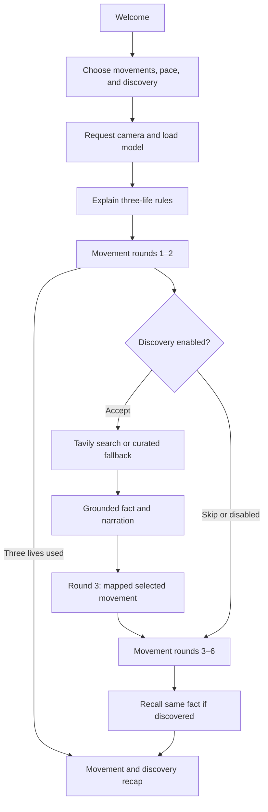

# Architecture

[Documentation](README.md) · [Developer guide](development.md) · [Shared contracts](../shared/README.md)

## System boundary

Simon Says is a Vite and React application. Movement inference runs in the browser. The backend contains small proxies for services that require secret keys.

MediaPipe sees the movement, ElevenLabs gives Simon his voice, and Tavily brings something new from the world into each session.

```mermaid
flowchart LR
    Camera --> MediaPipe[MediaPipe in browser]
    MediaPipe --> Engine[Movement game engine]
    Engine --> UI[React interface]
    UI --> Voice[/api/elevenlabs]
    UI --> Discovery[/api/tavily]
    Voice --> ElevenLabs
    Discovery --> Tavily
```

Camera frames never pass through the backend. The voice endpoint receives prompt text. The Tavily endpoint receives a supported topic only after discovery is accepted.

## Session flow



There is no practice round. A session ends after six rounds, three failed scored rounds, explicit exit, or a ten-second tracking/readiness timeout.

## Main components

| Area | Responsibility |
| --- | --- |
| `src/App.jsx` | Welcome, setup, game, and results routing |
| `ui/` | Product screens, brand components, controls, and responsive styling |
| `engine/gameEngine.js` | Commands, Simon Says/trick judging, timing, tracking, and readiness |
| `engine/sessionScore.js` | Three-life and result summary rules |
| `vision/checkPose.js` | Camera lifecycle, MediaPipe inference, movement scoring, and hints |
| `vision/poseTracking.js` | Fresh-frame confirmation and required-landmark rules |
| `voice/elevenlabs.js` | Speech preparation, deadlines, playback, fallback, and cancellation |
| `content/` | Supported discovery templates, source matching, and client request |
| `server/` and `api/` | Local and Vercel service handlers |
| `tests/` and `ui/VerificationLab.jsx` | Synthetic regression and flow verification |

## Movement judging

The setup exposes six poses: left/right hand up, touch head, arms out, touch shoulders, and touch nose. MediaPipe supplies 33 body landmarks. Distances are normalized to shoulder width and corrected for video aspect ratio.

The detector returns `{ matched, confidence, tracking, ready }`. `tracking` distinguishes a visible non-match from missing body points. `ready` confirms the commanded limb has released the target posture. Finger, thumb, and wrist points support touch movements; shoulder touches accept crossed or uncrossed hands; arms-out checks outward direction.

After approximately 400 ms of readiness, the instruction is spoken and shown. Fresh frames must hold a match briefly to reduce jitter. The active timer pauses during manual pause or lost tracking. Ten seconds without reliable tracking or readiness ends the session and releases the camera.

## Voice and discovery

Speech requests are cached, time-bounded, and fall back to browser speech. The visible instruction is authoritative when voice is unavailable.

Discovery uses a reviewed fact and question bank. Tavily retrieves evidence from allowed HTTPS sources; weak, contradictory, malformed, and disturbing snippets are withheld. Only canonical reviewed language is narrated, never arbitrary web instructions. The server allows a second template when the first lacks support, with one shared 12-second deadline. Missing credentials and failed retrieval return a curated item with explicit provenance. The browser also has a 14-second request deadline and curated fallback; exiting cancels the request and narration.

`content/discovery.js` normalizes the contract: `{ topic, fact, sourceTitle, sourceUrl, sourceDomain, movementHook, recallQuestion, answers, correctAnswer, retrieval }`. `correctAnswer` is an answer index; `retrieval` is `tavily` or `curated`. The existing `questions` response remains available for compatibility.

`movementHook` is a reviewed identifier, not an arbitrary pose. `discoveryMovement` prefers an appropriate supported pose (for example, arms out for a blue whale's size), then uses the first selected safe pose if needed. It returns the existing engine round contract with an explicit Simon Says command and the player's pacing. Pose selections stay in the browser. No seventh movement round is added.

`DiscoveryScreen` fetches only after acceptance, narrates the fact, and passes its mapped movement to round 3. `LearnScreen` receives that same discovery for recall after the remaining movement rounds, without another search. It retains buttons, gesture answers, pause, repeat, skip, and untimed answering. Recall totals never enter `summarizeSession`, so a wrong answer cannot alter movement lives or score. If the player loses all lives after discovery, recall is still offered before results; explicit exit or tracking failure ends play as before.

The source remains linked during the themed movement, recall, and recap. An expandable explanation shows interest, provenance, fact, safe movement, and recall usage. It exposes no request payloads or secrets.

The current discovery vocabulary is deliberately bounded to four reviewed facts across Animals and Space. Tavily supplies supporting evidence and selects the available item; there is no freeform language model generation. Adding topics requires reviewed facts, evidence rules, recall answers, and mapping tests.

## Current limits

See [current build](current-build.md) for the exact evidence. Automated geometry tests cover all six poses, but full real-camera accuracy across people, devices, framing, and lighting remains an acceptance requirement.
