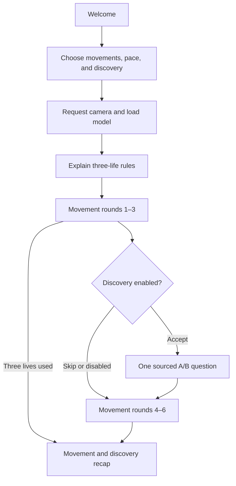

# Architecture

[Documentation](README.md) · [Developer guide](development.md) · [Shared contracts](../shared/README.md)

## System boundary

Simon Says is a Vite and React application. Movement inference runs in the browser. The backend contains small proxies for services that require secret keys.

```mermaid
flowchart LR
    Camera --> MediaPipe[MediaPipe in browser]
    MediaPipe --> Engine[Movement game engine]
    Engine --> UI[React interface]
    UI --> Voice[/api/elevenlabs]
    UI --> Discovery[/api/tavily]
    Voice --> ElevenLabs
    Discovery --> Tavily
```

Camera frames never pass through the backend. The voice endpoint receives prompt text. The Tavily endpoint receives a supported topic only after discovery is accepted.

## Session flow



There is no practice round. A session ends after six rounds, three failed scored rounds, explicit exit, or a ten-second tracking/readiness timeout.

## Main components

| Area | Responsibility |
| --- | --- |
| `src/App.jsx` | Welcome, setup, game, and results routing |
| `ui/` | Product screens, brand components, controls, and responsive styling |
| `engine/gameEngine.js` | Commands, Simon Says/trick judging, timing, tracking, and readiness |
| `engine/sessionScore.js` | Three-life and result summary rules |
| `vision/checkPose.js` | Camera lifecycle, MediaPipe inference, movement scoring, and hints |
| `vision/poseTracking.js` | Fresh-frame confirmation and required-landmark rules |
| `voice/elevenlabs.js` | Speech preparation, deadlines, playback, fallback, and cancellation |
| `content/` | Supported discovery templates, source matching, and client request |
| `server/` and `api/` | Local and Vercel service handlers |
| `tests/` and `ui/VerificationLab.jsx` | Synthetic regression and flow verification |

## Movement judging

The setup exposes six poses: left/right hand up, touch head, arms out, touch shoulders, and touch nose. MediaPipe supplies 33 body landmarks. Distances are normalized to shoulder width and corrected for video aspect ratio.

The detector returns `{ matched, confidence, tracking, ready }`. `tracking` distinguishes a visible non-match from missing body points. `ready` confirms the commanded limb has released the target posture. Finger, thumb, and wrist points support touch movements; shoulder touches accept crossed or uncrossed hands; arms-out checks outward direction.

After approximately 400 ms of readiness, the instruction is spoken and shown. Fresh frames must hold a match briefly to reduce jitter. The active timer pauses during manual pause or lost tracking. Ten seconds without reliable tracking or readiness ends the session and releases the camera.

## Voice and discovery

Speech requests are cached, time-bounded, and fall back to browser speech. The visible instruction is authoritative when voice is unavailable.

Discovery uses a reviewed question bank. Tavily retrieves evidence from allowed sources; unsupported results are withheld. The server allows a second template only when the first lacks support, with one shared deadline. Discovery failure returns to the movement session and never changes its score.

## Current limits

See [current build](current-build.md) for the exact evidence. Automated geometry tests cover all six poses, but full real-camera accuracy across people, devices, framing, and lighting remains an acceptance requirement.
