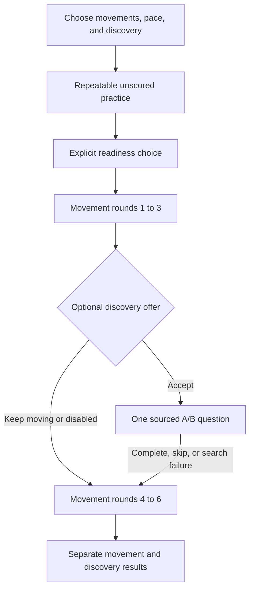

# Architecture

> Version scope: this guide describes review branch `improve/review-ready-interactions` at `814f65c`. The application on `main` is still the earlier build; use the review branch to follow this guide.

[Home](../README.md) · [Developer guide](development.md) · [Shared contracts](../shared/README.md)

Describes review commit `814f65c`.

## Session flow

## Components

| Path | Responsibility |
| --- | --- |
| `src/App.jsx` | Setup, session, and results transitions |
| `ui/GameScreen.jsx` | Practice, movement rounds, recovery controls, discovery handoff |
| `ui/LearnScreen.jsx` | Sourced question, gesture practices/button fallback, evidence |
| `engine/gameEngine.js` | Selected-pose rounds, neutral readiness, tracking-aware judging |
| `engine/learningEngine.js` | Exclusive A/B gesture selection |
| `vision/checkPose.js` | Camera, pose inference, tracking validity, reset and teardown |
| `shared/poses.js` | Shared constants and legacy JSDoc contracts |
| `voice/elevenlabs.js` | Prepared speech cache, playback, fallback, cancellation |
| `content/learningQuestions.js` | Four reviewed templates and source-evidence matching |
| `content/tavilyRounds.js` | Topic-based learning request client |
| `api/` and `server/` | Route wrappers and service proxies |
| `tests/` and `ui/VerificationLab.jsx` | Synthetic tests and development-only UI harness |

## Movement judging

The player selects from six active poses. Movement windows are 5, 8, or 12 seconds; tricks use three. After speech finishes, judging requires valid tracking and 400 ms of neutral confidence below 0.25 before Go. Active polling uses 100 ms waits. A real command passes on `matched`; a trick fails at confidence 0.45 or higher.

Pause and invalid tracking freeze active time and require neutral readiness again. Fifteen seconds of uninterrupted tracking loss returns an unscored result. Cancellation is also unscored. The session has no lives or elimination, and skips/tracking timeouts are excluded from its denominator. Response metrics exclude interrupted rounds.

## Services and data

| Endpoint or path | Input | Output or behavior |
| --- | --- | --- |
| `/api/elevenlabs` | POST `{ text }` | MPEG speech audio; keys server-side |
| `/api/tavily` | POST `{ topic: "space" }` or `{ topic: "animals" }` | `{ questions, topic }` with supported question data |
| MediaPipe browser runtime | Local camera frames | Pose confidence, match, and tracking validity; model assets downloaded externally |

Accepting discovery triggers one Tavily search for the chosen topic. A second template is searched only if the first provides no supported question; both attempts share a 12-second deadline. HTTPS domain checks and template-specific evidence matching filter results; one question is shown in the session. There is no offline fallback. The client bounds its wait to 16 seconds and can cancel on exit; failed searches allow movement to continue.

Speech preparation shares in-flight requests in a bounded cache with a five-second request timeout. Failed requests can retry. Failed audio playback can fall back to browser speech. Playback cancellation and object URL cleanup are implemented.

## Contracts and verification

The real detector returns `{ matched, confidence, tracking }`. The movement engine requires `tracking === true`; a legacy fake detector without this field is not a drop-in replacement. `resetPoseHistory` and `stopVision` support session boundaries. The shared JSDoc still describes older behavior; [shared contracts](../shared/README.md) records this discrepancy without changing code.

See the [evidence ledger](EVIDENCE_CASES.md) for executed synthetic checks and outstanding real-device validation. This documentation does not establish which revision is live in production.
